<picture>
  <source media="(prefers-color-scheme: dark)" srcset="hero.svg">
  
</picture>

# retractions

A public log of things we believed, published, and later disproved.

Science keeps retraction notices; engineering blogs keep silence. This repo is our correction ledger: one entry per belief that died, with what we believed, why it seemed true, what killed it, and what we changed afterwards. An entry here is a finished piece of work — the belief was strong enough to act on, and the evidence was strong enough to end it.

## Entries

| # | Belief | Killed by | Status |
|---|---|---|---|
| 1 | [WASM kernels are faster, period](entries/001-wasm-boundary.md) | our own benchmark table | corrected in place |
| 2 | [The auth-loader gate is a bug](entries/002-loader-gate-intent.md) | maintainers' resolution of a duplicate report | tests now pin the intent |
| 3 | [Continue is an active project](entries/003-continue-alive.md) | a 404 on its docs home | atlas row rewritten |
| 4 | [Docs are the spec](entries/004-docs-as-spec.md) | code and docs disagreeing in both directions | evidence rule added |

## House rules

- A retraction names the **belief**, not the person. Beliefs are ours; so are their corpses.
- Every entry carries the artifact that killed it: a benchmark table, an issue link, a 404, a code line.
- "Corrected in place" means the original artifact was edited with a visible note, not quietly rewritten. History stays legible.
- No entry is ever deleted. A retraction of a retraction gets its own number.

---

Orvii — Open, Research, Vision, Innovation & Ideas. If you find one of our published claims wrong, opening an issue here is a favor; we will either fix the claim or add the entry.
